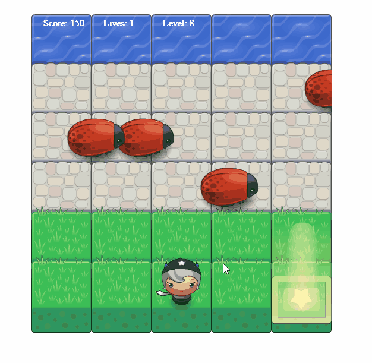

# Classic Arcade Game 

## Table of Contents

* [General Introduction](#General-Introduction) 
* [How The Game Works](#how-the-game-works)
* [Resources](#resources)

## Genera Introduction 

This is an Udacity Front-End Developer Project, with the practice of combining skills in HTML,CSS and JavaScript into a game based project. It is a great chance to practice JavaScript's object oriented programming features. At the same time, even though the visual assets and game loop engine are provided, it is still a good chance to learn their functionalities.

## How The Game Works 

Find the game at the following GitHub Project Page: [PLAY](https://ruonanruby.github.io/arcade-game/)

### Goal: let your preferred hero reaches the lake without colliding an enemy, 
but get as many gems and heart as you can! 

### Controls
**Use Arrow Keys to Move Your Hero**
- Left Arrow: move left
- Right Arrow: move right
- Down Arrow: move down
- Up Arrow: move up

-> The game starts once it loaded, you will have three lives and zero score at level 1.  
Enemies move slow and the gem at this level will not disappear until you get it!
(A sweet treat for ya!)  
What's more, during the game, you can change the character whenever you want!  
simply move the hero to the selector at right bottom, you will have a new hero without loosing
any score!

-> Reaches the lake to go next level. The Enemies will move faster. At the same time you will have a chance to get a heart for one more life and a gem to gain score. However, from this level, the gem only stays for 3 seconds, then it disappear.

-> Once you loose all the lives, the game ends. You can restart it by press enter key.

## Resources
- Start file from https://github.com/udacity/frontend-nanodegree-arcade-game
